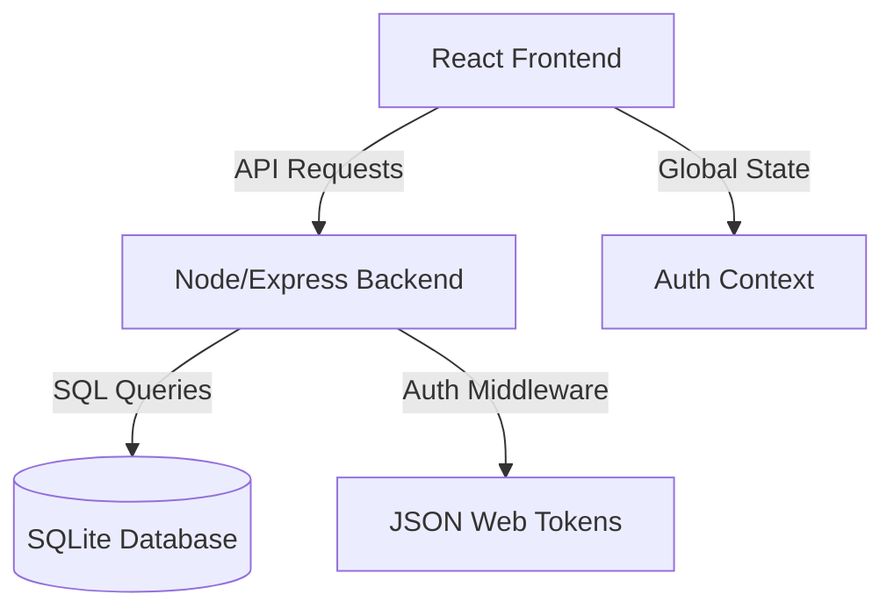

# 🚀 Intern Desk: Project Exploration Guide

This document serves as a "Master File" to explore the codebase. Every source file is mapped to its specific project task and architectural role. This guide is optimized for PDF conversion.

---

## 🏛 System Architecture Overview

The system follows a classic **MERN-like** architecture (using SQLite for portability):



---

## 📂 Code-to-Task Mapping

### 1. User Identity & Security
| File | Task / Purpose | Description |
| :--- | :--- | :--- |
| `client/src/pages/LoginPage.tsx` | **Authentication** | The entry point for existing users. Handles credential validation. |
| `client/src/pages/RegisterPage.tsx` | **User Onboarding** | Handles new user creation with role-based selection (Intern/Mentor). |
| `client/src/context/AuthContext.tsx` | **Session Management** | Persists user identity across the app via JWT and LocalStorage. |
| `client/src/components/ui/ProtectedRoute.tsx` | **Access Control** | Ensures only logged-in users can access the private dashboards. |

### 2. The Dashboard Ecosystem
| File | Task / Purpose | Description |
| :--- | :--- | :--- |
| `client/src/pages/ManagerDashboard.tsx` | **Admin Oversight** | The "Master Portal" for managing users, database queries, and system tables. |
| `client/src/pages/InternDashboard.tsx` | **Intern Workflow** | Task tracking, skill progress, and personal schedule for interns. |
| `client/src/pages/MentorDashboard.tsx` | **Mentor Guidance** | Tools for mentors to review intern progress and provide feedback. |
| `client/src/components/layout/Sidebar.tsx` | **Navigation** | The unified navigation hub for all dashboard views. |

### 3. Core Logic Engines
| File | Task / Purpose | Description |
| :--- | :--- | :--- |
| `client/src/components/ui/GenericDataPanel.tsx` | **CRUD Operations** | A powerful, generic engine that manages all Task/Goal/Resource lists. |
| `client/src/components/ui/MessagesPanel.tsx` | **Direct Messaging** | Handles the secure communication between Interns, Mentors, and Managers. |
| `client/src/components/ui/Modal.tsx` | **User Interaction** | A standardized UI layout for all interactive popups and forms. |
| `client/src/components/ui/Toast.tsx` | **System Feedback** | Real-time alerts for success (e.g., "Saved") and error notifications. |

### 4. Backend & Database
| File | Task / Purpose | Description |
| :--- | :--- | :--- |
| `server/server.js` | **Central API Hub** | The main Express server handling routing, database logic, and API endpoints. |
| `server/seed.js` | **Data Initialization** | Creates the database schema and seeds it with demo users and tasks. |
| `database/` | **Persistence** | Directory where the `.db` file resides, storing all system information. |

### 5. Project Materials
| File | Task / Purpose | Description |
| :--- | :--- | :--- |
| `ppt.tex` | **Presentation** | LaTeX source for the project's technical presentation (PPT). |
| `README.md` | **Documentation** | General project overview and setup instructions. |
| `deploy.md` | **Deployment** | Step-by-step guide for hosting the system on Render/Cloud. |
| `queries.md` | **DB Maintenance** | A collection of useful SQL queries for manual database inspection. |

---

## 🛠 Developer Workflow

### Start the Backend
```bash
cd server
npm run dev
```

### Start the Frontend
```bash
cd client
npm run dev
```

---

> [!TIP]
> **To generate a PDF of this guide:**
> 1. Open this file in VS Code.
> 2. Install the "Markdown PDF" extension.
> 3. Right-click anywhere in the file and select **Markdown PDF: Export (pdf)**.
